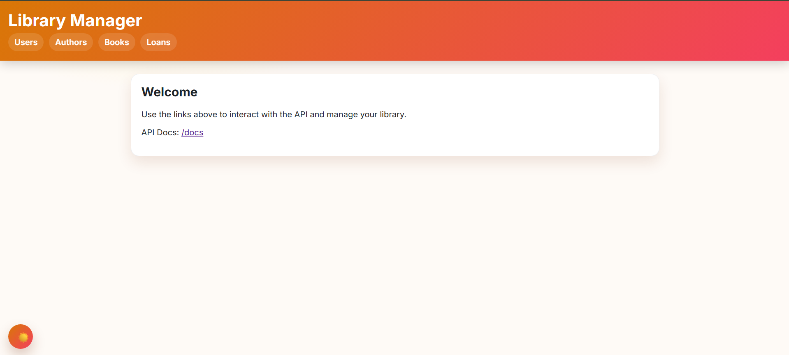
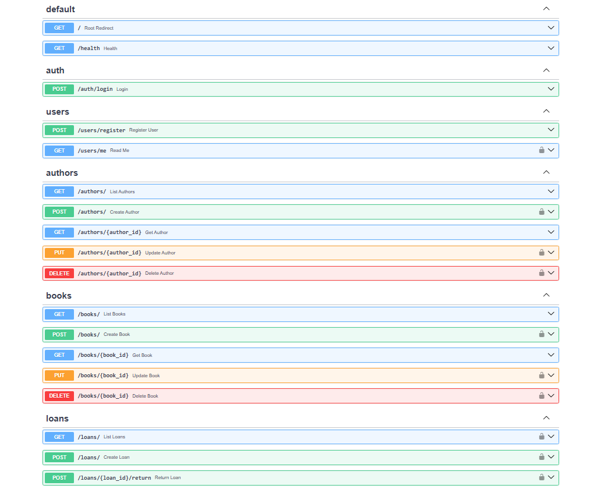

# Library Manager

“Library Manager” is a **library tracking system**. It records books, authors, and loan operations (borrow/return). The **backend** stores data, enforces rules, and exposes an **API**; the **frontend** is a simple web UI where users click buttons, submit forms, and see results. The goal is a foundation that’s **easy to learn** yet **scalable** to real‑world needs.

## Quick Start

```bash
# 1) Create & activate venv
python -m venv .venv
# Windows
.venv\Scripts\activate
# macOS/Linux
source .venv/bin/activate

# 2) Install deps
pip install -r requirements.txt

# 3) Environment
cp .env.example .env

# 4) Run the server
# If localhost:8000 hangs on Windows due to proxy/AV, prefer:
uvicorn src.api.main:app --reload --host 0.0.0.0 --port 9000
```

Open:

* UI:   `http://localhost:9000/ui`
  
* Docs: `http://localhost:9000/docs`
  
* Health: `http://localhost:9000/health`

---

## Architecture & Structure

Think of three layers:

* **Frontend (Web UI)** — plain HTML/CSS + a small `ui.js` file. Renders pages, reads form values, calls the API, shows toast notifications.
* **Backend (FastAPI)** — exposes endpoints (e.g., `/books`, `/authors`) that the UI calls.
* **Database (SQLAlchemy + Alembic)** — persistent storage. SQLAlchemy maps **Python classes ↔ tables**; Alembic versions schema changes.

```
┌─────────────────────────────────────────────────────┐
│                   Web UI (Static)                   │
│  • HTML + CSS + ui.js (toasts / theme / offline)    │
│  • Fetch calls the same-origin API                   │
└─────────────────────────────────────────────────────┘
                      │ HTTP JSON
                      ▼
┌─────────────────────────────────────────────────────┐
│                      FastAPI (API)                  │
│  • routers/: auth, users, authors, books, loans     │
│  • schemas/: Pydantic DTOs                          │
│  • services/: business rules                        │
│  • deps.py: DB & auth dependencies                  │
└─────────────────────────────────────────────────────┘
                      │ ORM
                      ▼
┌─────────────────────────────────────────────────────┐
│                   SQLAlchemy (ORM)                  │
│  • models/: User, Author, Book, Loan                │
│  • Alembic: versioned schema migrations             │
└─────────────────────────────────────────────────────┘
```

**Folder tree**

```
├─ src/
│  └─ api/
│     ├─ main.py                 
│     ├─ settings.py             
│     ├─ db.py                   
│     ├─ deps.py                 
│     ├─ models/                 
│     ├─ schemas/                
│     ├─ services/              
│     └─ routers/                
│
├─ web/                         
│  ├─ index.html
│  ├─ assets/
│  │  ├─ styles.css
│  │  └─ ui.js
│  └─ pages/ (users/authors/books/loans)
│
├─ alembic/                     
│  ├─ env.py
│  └─ versions/<timestamp>_init.py
├─ requirements.txt
├─ .env.example
├─ alembic.ini
└─ README.md
```

---

## What is an API?

An **API** is how one program talks to another. This project uses **JSON over HTTP**. Examples:

* `GET /books` → list books
* `POST /books` → create a new book

Because the contract is HTTP+JSON, you can later replace the UI (e.g., React/Vue) without changing the backend.

---

## Auth: Why JWT?

Some actions require sign‑in (adding books, creating loans). On **login**, the backend returns a short‑lived **JWT**. Clients send this token in the `Authorization: Bearer <JWT>` header. The backend validates it and authorizes the request. Simple and secure.

---

## Data Model

Each table is represented by a class:

* **User** — login info (email, password hash)
* **Author** — authors
* **Book** — title, author, total copies, available copies
* **Loan** — who borrowed which book, when, and whether it’s returned

Relationships: an **Author** has many **Books** (1→N). A **Loan** references both a **Book** and a **User**. Relationships are declared via SQLAlchemy’s `relationship` for natural navigation in code.

---

## Business Rules (Service Layer)

* **Borrow**: if `copies_available > 0`, decrement it and create a `Loan`.
* **Return**: mark loan `returned` and increment `copies_available` (capped at `copies_total`).

These rules live in `services/` (e.g., `loan_service.py`), keeping endpoints clean and easier to test.

---

## OOP & Design

* **Entities as classes** (`Book`, `Author`, ...), relationships between classes.
* **DTOs (Pydantic)** for clear input/output contracts and validation.
* **Service layer** centralizes business logic; avoids duplication.
* **Dependency Injection** (FastAPI `Depends`) injects DB session/current user.
---

## How the Frontend Works

Pages like `books.html` contain forms and buttons. On actions (e.g., **Add Book**), `ui.js` reads the form, sends a `fetch` request to the **same‑origin** API, and shows a toast on success/error. Theme preference (light/dark/auto) is stored in `localStorage`. If the backend is down, an **offline** toast appears.

---

## Why Alembic?

Schemas evolve. **Alembic** records changes as **migrations** so all environments stay in sync, and you can roll back if needed. In short: *version control for your DB schema*.

---

## Security Basics

* Never store plaintext passwords — use **bcrypt** hashes.
* Keep the JWT **`SECRET_KEY`** strong and private; rotate on compromise.
* Use **CORS** only if you need to expose the API to other origins.
* In production, terminate **HTTPS** at a reverse proxy and consider **rate limiting**.

---

## Performance & Scalability

* Dev: **SQLite** (simple and fast). Prod: **Postgres** with a connection pool.
* Add DB **indexes** for frequent lookups (ISBN, `author_id`, `user_id`).
* Avoid **N+1** queries; use **eager loading** when needed.

---

## Common Issues & Quick Fixes

* **`/docs` or `/ui` stuck on “Loading…”** → often missing `python-multipart`. Install it. On Windows, if localhost is blocked by proxy/VPN, run with `--host 0.0.0.0 --port 9000` and open `http://localhost:9000/ui`.
* **CSS/JS changes not visible** → browser cache; press **Ctrl+F5** or try a private window; optionally add `?v=1` to the stylesheet URL.
* **UI loads but API is down** → UI calls **same origin**; a red toast will warn you if the backend is off.

---

## License

Released under the **MIT License**. See [LICENSE](LICENSE) for details.
